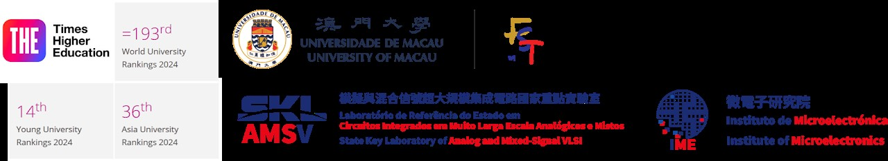
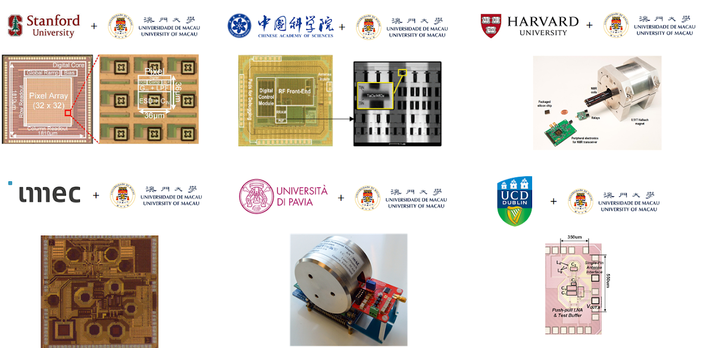

IEEE Fellow | IET Fellow | RSC Fellow   
Foreign Academician, Academy of Sciences of Lisbon, Portugal   
Overseas Expert, Chinese Academy of Sciences   
Visiting Chair Professorship, Chinese Ministry of Education  
  
Editor-in-Chief, IEEE Solid-State Circuits Letters (2024-2026)  
ISSCC 70th Anniversary Top Contributing Authors (2023)  
Tencent Xplorer Prize (2022)  
National Science and Technology Progress Award (2011)

**Full Professor**  
[Faculty of Science & Technology - ECE](https://www.fst.um.edu.mo/ece/), [<u>University of Macau</u>](https://www.um.edu.mo/) (UM), Macau, China  
**Director**  
[State-Key Laboratory of Analog & Mixed-Signal VLSI](https://ime.um.edu.mo/), UM, Macau, China  
**Deputy Director (Research)**  
[Institute of Microelectronics](https://ime.um.edu.mo/), UM, Macau, China  
**Co-Founder**    
[DigiFluidic Biotech Ltd](https://www.digifluidic.com/), China

Email: pimak_at_umac.mo  
University Page: [https://www.fst.um.edu.mo/people/pimak/](https://www.fst.um.edu.mo/people/pimak/)

**Pui-In Mak (Elvis)** was born in **Macau** ('79), and raised there with his early education in Escola de Santa Teresa and Instituto Salesiano. He received the B.Sc. (’03) and Ph.D. (’06) degrees from the **University of Macau** (UM), where he is currently **Full Professor** at the Faculty of Science and Technology (FST) - Electrical and Computer Engineering (ECE); **Director** at the **State-Key Laboratory of Analog and Mixed-Signal VLSI**, and **Deputy Director (Research)** at the **Institute of Microelectronics**. He was a **Clare-Hall Visiting Fellow** ('09) of the **University of Cambridge**, UK. His research focuses are on circuits and systems for wireless and multidisciplinary innovations. He has advised/is advising **60+ graduate students** and **20+ researchers** (RA/post-doc).  

He co-developed **39 state-of-the-art chips** which are reported consecutively at the **2011-2024 IEEE International Solid-State Circuits Conference - ISSCC (Chip Olympics), of which 10 are ISSCC Highlight Papers**. His graduates are with universities and companies developing cutting-edge research/products for a wide variety of applications like 5G-NR, precision analog, IoE connectivity and automotive.  

His group pioneered the **Intelligent Digital Microfluidic (iDMF) platform** and **micro-Nuclear Magnetic Resonance (micro-NMR) plaftorm** for biological/chemical diagnostics. They led to many multidisciplinary publications in the journals like *Nature Communications, Nature PG - Microsystems & Nanoengineering, Scientific Reports, RSC Lab on a Chip, RSC Analyst, ACS Analytical Chemistry, ACS Sensors, Oxford Bioinformatics, Elsevier Biosensors and Bioelectronics, Elsevier Sensors and Actuators*. In 2018, the group founded the **DigiFluidic Biotech Ltd**. for commercializing the iDMF platform for virus screening and food-quality monitoring. 

Prof. Mak has co-authored **~520 publications** (11 books/book chapters, ~280 journal papers and ~230 conference papers) and holds **35+ patents** (issued/filed). He has delivered >**120 lectures** as **keynotes** (PRIME’16, RFID-TA’16, ICAC'19, ICTA'19, APCCAS'21, ICICM'22, ICICM'23), **industrial seminars** (Qualcomm’17, imec’17) and **tutorials/short courses** (ISCAS’12, APCCAS’12, VLSI-DAT’15, ACTS'20).  

He is the Editor-in-Chief of the **IEEE Solid-State Circuits Letters - SSCL** ('24-Present). He was the Editorial Board Member of **IEEE Press** (’14-’16); Senior Editor of **IEEE Journal on Emerging and Selected Topics in Circuits and Systems - JETCAS** (’14-’15); Associate Editor of **IEEE Journal of Solid-State Circuits - JSSC** (’18-'24), **IEEE Solid-State Circuits Letters - SSCL** (’17-'23), **IEEE Transactions on Circuits and Systems I - TCAS-I** (’10-’11, ’14-’15), **IEEE Transactions on Circuits and Systems II** - TCAS-II (’10-’13) and **IOP Journal of Semiconductors - JOS** ('21-'23); Guest Editor of **IEEE RFIC Virtual Journal** (’14), **JSSC** (’18), **JETCAS** (’18) and **IEEE Sensors Journal** ('19). For IEEE conferences, he was the TPC Vice Chair of **ASP-DAC** (’16), TPC Member of **ISSCC** ('17-'19), **ESSCIRC** (’16-’17) and **A-SSCC** (’13-’16, '19).  

He co-received numerous paper awards in leading conferences, e.g. RFIC'21, APCCAS'19, ISSCC-SRP'19, IMCO'19, ISSCC’16, A-SSCC’15, ASQED’13, APCCAS’08, DAC/ISSCC’05, MWSCAS’04 and ASICON'03. He co-received the IEEE/CEDA Outstanding Service Award’17; **IEEE CASS Outstanding Young Author Award’10**; IEEE CASS Chapter-of-the-Year Award’09; IEEE MGA GOLD Achievement Award’09 and **Best Associate Editor of TCAS-II’12-’13**. His students received **7 SSCS Predoctoral Achievement Awards**.  

Prof. Mak was decorated **Macau Honorary Title of Value’05** for scientific merits. He received 7 **Macau Science & Technology Awards’12'12'14'16'20'22'22**, 6 UM Research/Academic Awards, and the **UM FST 30th Anniversary Outstanding Alumni Award'19**.  He received the **Tencent Xplorer Prize'22** and is recognized in 2023 as one of the **Top Contributing Authors of ISSCC** in the past 70 years (1954-2023).  

Prof. Mak currently leads a team of faculties and students with collaboration across the global (e.g. **Chinese Academy of Sciences, Stanford U., Harvard U., U. of Pavia, imec, UC Dublin, INL, IST-ULisboa, Universiti Malaya, UESTC, SUSTech,  Shenzhen U., SYSU and XJTU**).

Career Highlights:  
+ Foreign Academician (Corresponding Member), [**Academy of Sciences of Lisbon, Portugal**](https://www.acad-ciencias.pt/), since 2024

+ Editor-in-Chief, [**IEEE Solid-State Circuits Letters (SSCL)**](https://sscs.ieee.org/publications/ieee-solid-state-circuits-letters-ssc-l) , as the first Asian scholar appointed, 2024-2026

+ AdCom Member, [**IEEE Solid-State Circuits Society Administrative Committee (SSCS AdCom)**](https://sscs.ieee.org/about/governance-sscs-adcom), 2024-2026

+ ISSCC Author-Recognition Award, [**IEEE International Solid-State Circuits Conference (ISSCC)**](https://www.isscc.org/), for top ISSCC contributing authors for its first 70 years, 2023

+ Xplorer Prize, [**Tencent Foundation and 14 renowned scientists**](https://xplorerprize.org/), 2022

+ Fellow, [**UK Royal Society of Chemistry (RSC)**](http://www.rsc.org) for contribution to the advancement of the chemical sciences, since 2020

+ Fellow, [**Institute of Electrical and Electronics Engineers (IEEE)**](http://www.ieee.org) for contribution to radio-frequency and analog circuits, since 2019

+ Fellow, [**Institution of Engineering and Technology (IET)**](http://www.theiet.org) for contribution to engineering research, education & services, since 2018

+ Overseas Expert, [**Chinese Academy of Sciences (CAS)**](http://english.cas.cn/) for leading expertise in integrated circuits, since 2018

+ Chairperson of Distinguished Lecturer Program, [**IEEE Circuits and Systems Society (CASS)**](https://ieee-cas.org/) (2018 - 2019) 

+ Distinguished Lecturer, [**IEEE Solid-State Circuits Society (SSCS)**](https://sscs.ieee.org/) (2017 - 2018) 

+ Distinguished Lecturer, [**IEEE Circuits and Systems Society (CASS)**](https://ieee-cas.org/) (2014 - 2015) 

+ Elected Members-At-Large (Board-of-Governor), [**IEEE Circuits and Systems Society (CASS)**](https://ieee-cas.org/) (2009 - 2011)

+ Clare-Hall Visiting Fellow, [**University of Cambridge**](https://www.clarehall.cam.ac.uk/), UK, 2009

Links:

+ Foreign Academician, Academy of Sciences of Lisbon, Portugal Press Release ([**Chinese**](https://www.um.edu.mo/zh-hant/news-and-press-releases/presss-release/detail/57951/)) and ([**English**](https://www.um.edu.mo/news-and-press-releases/press-release/detail/57951/))

+ Xplorer Prize Press Release ([**Chinese**](https://www.um.edu.mo/zh-hant/news-and-press-releases/presss-release/detail/54158/)) and ([**English**](https://www.um.edu.mo/news-and-press-releases/press-release/detail/54158/))

+ RSC Fellowship Press Release ([**Chinese**](https://www.um.edu.mo/zh-hant/news-centre/news-and-events/news-and-press-releases/detail/50130/#news_title)) and ([**English**](https://www.um.edu.mo/news-centre/news-and-events/news-and-press-releases/detail/50130/)) 

+ IEEE Fellowship Press Release ([**Chinese**](https://www.um.edu.mo/zh-hant/news-centre/news-and-events/news-and-press-releases/detail/46748/)) and ([**English**](https://www.um.edu.mo/news-centre/news-and-events/news-and-press-releases/detail/46748/)) 

+ Chinese Academy of Sciences Overseas Expert Press Release ([**Chinese**](https://www.um.edu.mo/zh-hant/news-and-press-releases/presss-release/detail/45839/)) and ([**English**](https://www.um.edu.mo/news-and-press-releases/press-release/detail/45839/)) 

