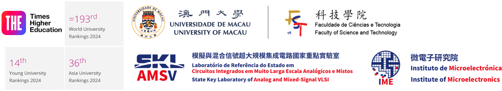

<!-- 容器部分 -->

  <!-- 个人信息部分 -->
  

    
    

      
IEEE Fellow | IET Fellow | RSC Fellow 

      
Foreign Academician, Academy of Sciences of Lisbon, Portugal

      
Overseas Expert, Chinese Academy of Sciences

      
Visiting Chair Professorship, Chinese Ministry of Education

      
  

      
Editor-in-Chief, IEEE Solid-State Circuits Letters (2024-2026)

      
ISSCC 70th Anniversary Top Contributing Authors (2023)

      
Tencent Xplorer Prize (2022)

      
National Science and Technology Progress Award (2011)

      
  

      
<strong>Full Professor</strong>

      
<a href="https://www.fst.um.edu.mo/ece/" style="text-decoration: none;">Faculty of Science & Technology - ECE</a>, <a href="https://www.um.edu.mo/" style="text-decoration: underline;">University of Macau</a> (UM), Macau, China 

      
<strong>Director</strong>

      
<a href="https://ime.um.edu.mo/" style="text-decoration: none;">State-Key Laboratory of Analog & Mixed-Signal VLSI</a>, UM, Macau, China 

      
<strong>Deputy Director (Research)</strong>

      
<a href="https://ime.um.edu.mo/" style="text-decoration: none;">Institute of Microelectronics</a>, UM, Macau, China 

      
<strong>Co-Founder</strong>

      
<a href="https://www.digifluidic.com/" style="text-decoration: none;">DigiFluidic Biotech Ltd</a>, China

      
Email: pimak_at_umac.mo

      
University Page: <a href="https://www.fst.um.edu.mo/people/pimak/" style="text-decoration: none;">https://www.fst.um.edu.mo/people/pimak/</a>, China

    

  

  <!-- 全宽图片部分 -->
  

    
  

  <!-- 全宽文本内容 -->
  

    
全宽文本内容...

  

  

<!-- 全宽文本内容 -->

  
全宽文本内容...

