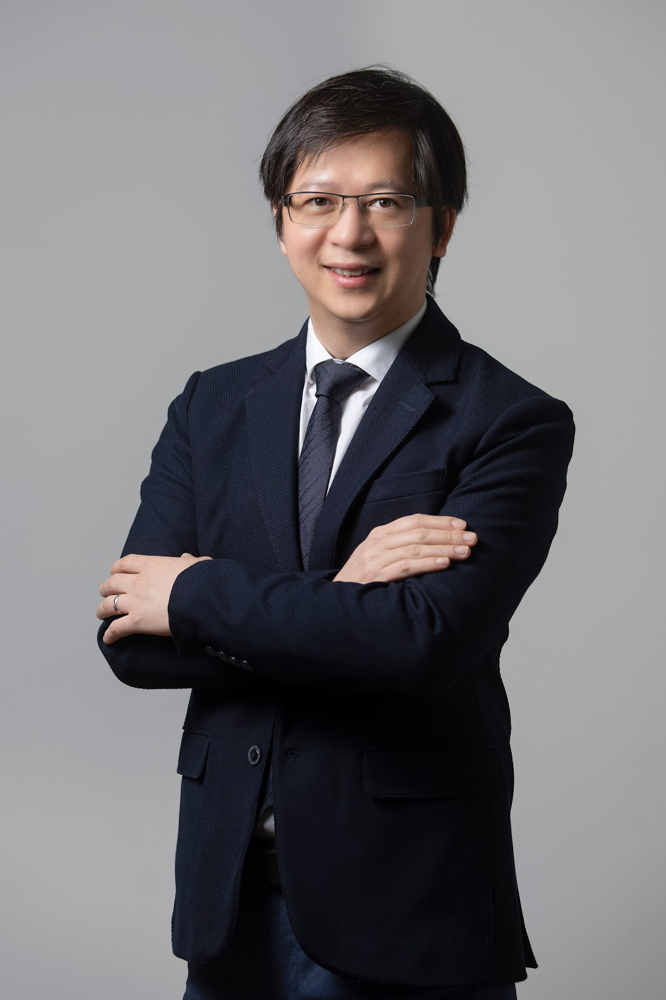
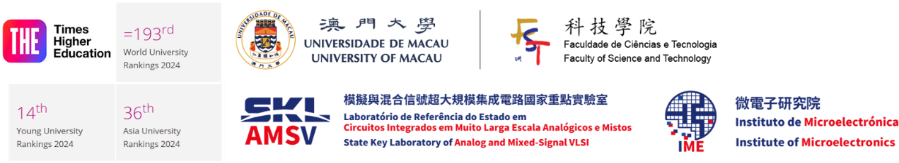
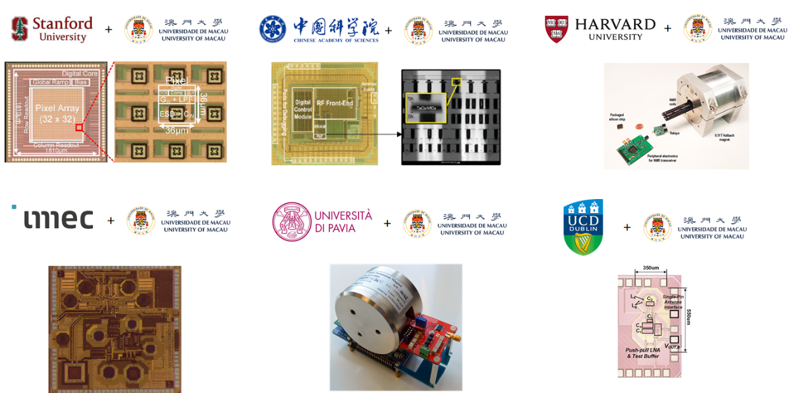
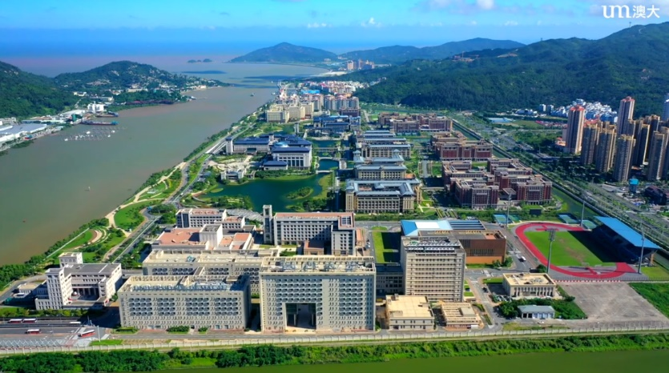
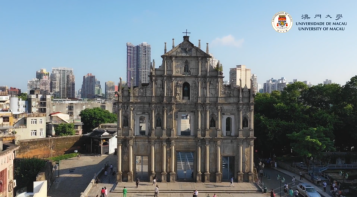

<!-- 容器部分 -->

  <!-- 个人信息部分 -->
  

    
    

      
IEEE Fellow | IET Fellow | RSC Fellow 

      
Foreign Academician, Academy of Sciences of Lisbon, Portugal

      
Overseas Expert, Chinese Academy of Sciences

      
Visiting Chair Professorship, Chinese Ministry of Education

       
      
Editor-in-Chief, IEEE Solid-State Circuits Letters (2024-2026)

      
ISSCC 70th Anniversary Top Contributing Authors (2023)

      
Tencent Xplorer Prize (2022)

      
National Science and Technology Progress Award (2011)

       
      
<strong>Full Professor</strong>

      
<a href="https://www.fst.um.edu.mo/ece/" style="text-decoration: none;">Faculty of Science & Technology - ECE</a>, <a href="https://www.um.edu.mo/" style="text-decoration: underline;">University of Macau</a> (UM), Macau, China 

      
<strong>Director</strong>

      
<a href="https://ime.um.edu.mo/" style="text-decoration: none;">State-Key Laboratory of Analog & Mixed-Signal VLSI</a>, UM, Macau, China 

      
<strong>Deputy Director (Research)</strong>

      
<a href="https://ime.um.edu.mo/" style="text-decoration: none;">Institute of Microelectronics</a>, UM, Macau, China 

      
<strong>Co-Founder</strong>

      
<a href="https://www.digifluidic.com/" style="text-decoration: none;">DigiFluidic Biotech Ltd</a>, China

       
      
Email: pimak_at_umac.mo

      
University Page: <a href="https://www.fst.um.edu.mo/people/pimak/" style="text-decoration: none;">https://www.fst.um.edu.mo/people/pimak/</a>, China

    

  

  <!-- 全宽图片部分 -->
  

    
  

  <!-- 全宽文本内容 -->
  

    
<strong>Pui-In Mak (Elvis)</strong> was born in <strong>Macau</strong> ('79), and raised there with his early education in Escola de Santa Teresa and Instituto Salesiano. He received the B.Sc. (’03) and Ph.D. (’06) degrees from the <strong>University of Macau</strong> (UM), where he is currently <strong>Full Professor</strong> at the Faculty of Science and Technology (FST) - Electrical and Computer Engineering (ECE); <strong>Director</strong> at the <strong>State-Key Laboratory of Analog and Mixed-Signal VLSI</strong>, and <strong>Deputy Director (Research)</strong> at the <strong>Institute of Microelectronics</strong>. He was a <strong>Clare-Hall Visiting Fellow</strong> ('09) of the <strong>University of Cambridge</strong>, UK. His research focuses are on circuits and systems for wireless and multidisciplinary innovations. He has advised/is advising <strong>60+ graduate students</strong> and <strong>20+ researchers</strong> (RA/post-doc).

    
He co-developed <strong>39 state-of-the-art chips</strong> which are reported consecutively at the <strong>2011-2024 IEEE International Solid-State Circuits Conference - ISSCC (Chip Olympics), of which 10 are ISSCC Highlight Papers</strong>. His graduates are with universities and companies developing cutting-edge research/products for a wide variety of applications like 5G-NR, precision analog, IoE connectivity and automotive.

    
His group pioneered the <strong>Intelligent Digital Microfluidic (iDMF) platform</strong> and <strong>micro-Nuclear Magnetic Resonance (micro-NMR) platform</strong> for biological/chemical diagnostics. They led to many multidisciplinary publications in the journals like <em>Nature Communications, Nature PG - Microsystems & Nanoengineering, Scientific Reports, RSC Lab on a Chip, RSC Analyst, ACS Analytical Chemistry, ACS Sensors, Oxford Bioinformatics, Elsevier Biosensors and Bioelectronics, Elsevier Sensors and Actuators</em>. In 2018, the group founded the <strong>DigiFluidic Biotech Ltd</strong> for commercializing the iDMF platform for virus screening and food-quality monitoring.

    
Prof. Mak has co-authored <strong>~520 publications</strong> (11 books/book chapters, ~280 journal papers and ~230 conference papers) and holds <strong>35+ patents</strong> (issued/filed). He has delivered &gt;<strong>120 lectures</strong> as <strong>keynotes</strong> (PRIME’16, RFID-TA’16, ICAC'19, ICTA'19, APCCAS'21, ICICM'22, ICICM'23), <strong>industrial seminars</strong> (Qualcomm’17, imec’17) and <strong>tutorials/short courses</strong> (ISCAS’12, APCCAS’12, VLSI-DAT’15, ACTS'20).

    
He is the Editor-in-Chief of the <strong>IEEE Solid-State Circuits Letters - SSCL</strong> ('24-Present). He was the Editorial Board Member of <strong>IEEE Press</strong> (’14-’16); Senior Editor of <strong>IEEE Journal on Emerging and Selected Topics in Circuits and Systems - JETCAS</strong> (’14-’15); Associate Editor of <strong>IEEE Journal of Solid-State Circuits - JSSC</strong> (’18-'24), <strong>IEEE Solid-State Circuits Letters - SSCL</strong> (’17-'23), <strong>IEEE Transactions on Circuits and Systems I - TCAS-I</strong> (’10-’11, ’14-’15), <strong>IEEE Transactions on Circuits and Systems II - TCAS-II</strong> (’10-’13) and <strong>IOP Journal of Semiconductors - JOS</strong> ('21-'23); Guest Editor of <strong>IEEE RFIC Virtual Journal</strong> (’14), <strong>JSSC</strong> (’18), <strong>JETCAS</strong> (’18) and <strong>IEEE Sensors Journal</strong> ('19). For IEEE conferences, he was the TPC Vice Chair of <strong>ASP-DAC</strong> (’16), TPC Member of <strong>ISSCC</strong> ('17-'19), <strong>ESSCIRC</strong> (’16-’17) and <strong>A-SSCC</strong> (’13-’16, '19).

    
He co-received numerous paper awards in leading conferences, e.g. RFIC'21, APCCAS'19, ISSCC-SRP'19, IMCO'19, ISSCC’16, A-SSCC’15, ASQED’13, APCCAS’08, DAC/ISSCC’05, MWSCAS’04 and ASICON'03. He co-received the IEEE/CEDA Outstanding Service Award’17; <strong>IEEE CASS Outstanding Young Author Award’10</strong>; IEEE CASS Chapter-of-the-Year Award’09; IEEE MGA GOLD Achievement Award’09 and <strong>Best Associate Editor of TCAS-II’12-’13</strong>. His students received <strong>7 SSCS Predoctoral Achievement Awards</strong>.

    
Prof. Mak was decorated <strong>Macau Honorary Title of Value’05</strong> for scientific merits. He received 7 <strong>Macau Science & Technology Awards’12'12'14'16'20'22'22</strong>, 6 UM Research/Academic Awards, and the <strong>UM FST 30th Anniversary Outstanding Alumni Award'19</strong>. He received the <strong>Tencent Xplorer Prize'22</strong> and is recognized in 2023 as one of the <strong>Top Contributing Authors of ISSCC</strong> in the past 70 years (1954-2023).

     
    
Prof. Mak currently leads a team of faculties and students with collaboration across the global (e.g. <strong>Chinese Academy of Sciences, Stanford U., Harvard U., U. of Pavia, imec, UC Dublin, INL, IST-ULisboa, Universiti Malaya, UESTC, SUSTech, Shenzhen U., SYSU and XJTU</strong>).

  
  

  <!-- 全宽图片部分 -->
  

    
  

  <!-- 全宽文本内容 -->
  

    
<strong>Career Highlights:</strong>

      <ul>
        <li>Foreign Academician (Corresponding Member), <a href="https://www.acad-ciencias.pt/" target="_blank"><strong>Academy of Sciences of Lisbon, Portugal</strong></a>, since 2024</li>
        <li>Editor-in-Chief, <a href="https://sscs.ieee.org/publications/ieee-solid-state-circuits-letters-ssc-l" target="_blank"><strong>IEEE Solid-State Circuits Letters (SSCL)</strong></a>, as the first Asian scholar appointed, 2024-2026</li>
        <li>AdCom Member, <a href="https://sscs.ieee.org/about/governance-sscs-adcom" target="_blank"><strong>IEEE Solid-State Circuits Society Administrative Committee (SSCS AdCom)</strong></a>, 2024-2026</li>
        <li>ISSCC Author-Recognition Award, <a href="https://www.isscc.org/" target="_blank"><strong>IEEE International Solid-State Circuits Conference (ISSCC)</strong></a>, for top ISSCC contributing authors for its first 70 years, 2023</li>
        <li>Xplorer Prize, <a href="https://xplorerprize.org/" target="_blank"><strong>Tencent Foundation and 14 renowned scientists</strong></a>, 2022</li>
        <li>Fellow, <a href="http://www.rsc.org" target="_blank"><strong>UK Royal Society of Chemistry (RSC)</strong></a> for contribution to the advancement of the chemical sciences, since 2020</li>
        <li>Fellow, <a href="http://www.ieee.org" target="_blank"><strong>Institute of Electrical and Electronics Engineers (IEEE)</strong></a> for contribution to radio-frequency and analog circuits, since 2019</li>
        <li>Fellow, <a href="http://www.theiet.org" target="_blank"><strong>Institution of Engineering and Technology (IET)</strong></a> for contribution to engineering research, education & services, since 2018</li>
        <li>Overseas Expert, <a href="http://english.cas.cn/" target="_blank"><strong>Chinese Academy of Sciences (CAS)</strong></a> for leading expertise in integrated circuits, since 2018</li>
        <li>Chairperson of Distinguished Lecturer Program, <a href="https://ieee-cas.org/" target="_blank"><strong>IEEE Circuits and Systems Society (CASS)</strong></a> (2018 - 2019)</li>
        <li>Distinguished Lecturer, <a href="https://sscs.ieee.org/" target="_blank"><strong>IEEE Solid-State Circuits Society (SSCS)</strong></a> (2017 - 2018)</li>
        <li>Distinguished Lecturer, <a href="https://ieee-cas.org/" target="_blank"><strong>IEEE Circuits and Systems Society (CASS)</strong></a> (2014 - 2015)</li>
        <li>Elected Members-At-Large (Board-of-Governor), <a href="https://ieee-cas.org/" target="_blank"><strong>IEEE Circuits and Systems Society (CASS)</strong></a> (2009 - 2011)</li>
        <li>Clare-Hall Visiting Fellow, <a href="https://www.clarehall.cam.ac.uk/" target="_blank"><strong>University of Cambridge</strong></a>, UK, 2009</li>
      </ul>   
    
<strong>Links:</strong>

      <ul>
        <li>「问芯」采访 <a href="https://mp.weixin.qq.com/s?__biz=MzI2NjIwNjg1Mg==&mid=2247491370&idx=1&sn=825f2bdefdb69bb328649d320c1cc8d5&chksm=eb7f1c4e3e6a3fa4d5f2b660a165f598c51bcef472930d58df153a77cef4fbdc9420c4619798&scene=126&sessionid=1723187059#rd)" target="_blank"><strong>Interview</strong></a></li>
        <li>Foreign Academician, Academy of Sciences of Lisbon, Portugal Press Release (<a href="https://www.um.edu.mo/zh-hant/news-and-press-releases/presss-release/detail/57951/" target="_blank"><strong>Chinese</strong></a>) and (<a href="https://www.um.edu.mo/news-and-press-releases/press-release/detail/57951/" target="_blank"><strong>English</strong></a>)</li>
        <li>Xplorer Prize Press Release (<a href="https://www.um.edu.mo/zh-hant/news-and-press-releases/presss-release/detail/54158/" target="_blank"><strong>Chinese</strong></a>) and (<a href="https://www.um.edu.mo/news-and-press-releases/press-release/detail/54158/" target="_blank"><strong>English</strong></a>)</li>
        <li>RSC Fellowship Press Release (<a href="https://www.um.edu.mo/zh-hant/news-centre/news-and-events/news-and-press-releases/detail/50130/#news_title" target="_blank"><strong>Chinese</strong></a>) and (<a href="https://www.um.edu.mo/news-centre/news-and-events/news-and-press-releases/detail/50130/" target="_blank"><strong>English</strong></a>)</li>
        <li>IEEE Fellowship Press Release (<a href="https://www.um.edu.mo/zh-hant/news-centre/news-and-events/news-and-press-releases/detail/46748/" target="_blank"><strong>Chinese</strong></a>) and (<a href="https://www.um.edu.mo/news-centre/news-and-events/news-and-press-releases/detail/46748/" target="_blank"><strong>English</strong></a>)</li>
        <li>Chinese Academy of Sciences Overseas Expert Press Release (<a href="https://www.um.edu.mo/zh-hant/news-and-press-releases/presss-release/detail/45839/" target="_blank"><strong>Chinese</strong></a>) and (<a href="https://www.um.edu.mo/news-and-press-releases/press-release/detail/45839/" target="_blank"><strong>English</strong></a>)</li>
      </ul>
  

  <!-- 三个视频部分 -->
  

    

      
      
<strong>University of Macau Introduction</strong>

    

    

      
      
<strong>State-Key Lab of AMSV Video</strong>

    

    

      
      
<strong>Digifluidic Virus Hunter Plus Video</strong>

    

  

  

