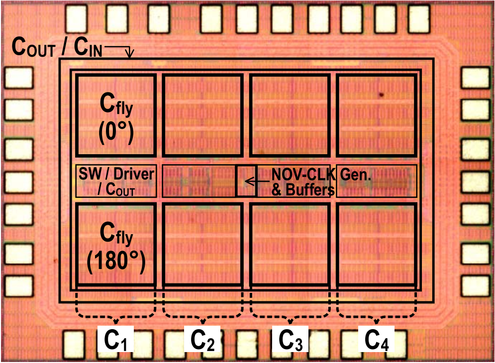
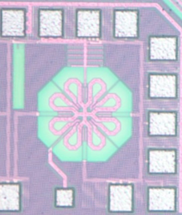
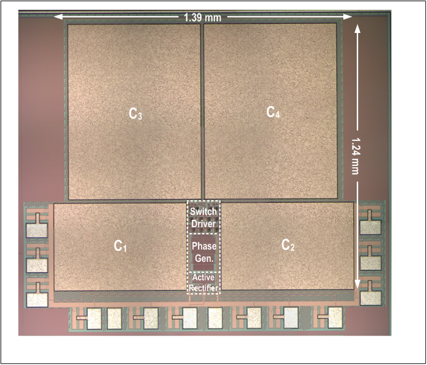

* **49 JSSC Papers (20 are Invited Papers)**

* **39 ISSCC Papers (10 are Highlight Papers, 5 Live Demos)**

* **4 SSCL Papers**

* **32 Papers in VLSI/A-SSCC/CICC/ESSCIRC/RFIC**

* **7 SSCS Predoctoral Achievement Awards**

* **4 ISSCC Awards (Top Paper Contributors, Silkroad, Student Research Preview, Student Design Contest)**

* **1 A-SSCC Distinguished Design Award**

* **1 RFIC Student Paper Award**

  
  

    
<strong>A 90.7-nW Vibration-Based Condition Monitoring Chip Featuring a Digital Compute-in-Memory-Based DNN Accelerator Using an Ultra-Low-Power 13T-SRAM Cell</strong>

    
Z. Zhang, W.-H. Yu, Z. Yang, K.-F. Un, J. Yin, R. P. Martins, P.-I. Mak

    <ul style="list-style-type: disc; margin: 0; padding-left: 20px;">
      <li>[JSSC'24]</li>
    </ul>
  

  
  

    
<strong>A 16-MHz Crystal Oscillator with 17.5-μs Startup Time under 10 4 -ppm-∆F Injection Using Automatic Phase-Error Correction</strong>

    
Z. Wang, X. Wang, K.-M. Lei, W. Zhang, Y. Yin, T. Xu, Z. Cai, Y. Guo, P.-I. Mak

    <ul style="list-style-type: disc; margin: 0; padding-left: 20px;">
      <li>[JSSC'24]</li>
    </ul>
  

  
  

    
<strong>A 28-nm 18.7 TOPS/mm 2 89.4-to-234.6 TOPS/W 8b Single-Finger eDRAM Compute-in-memory Macro with Bit-wise Sparsity Aware and Kernel-wise Weight Update/Refresh</strong>

    
Y. Zhan, W.-H. Yu, K.-F. Un, R. Martins, P.-I. Mak

    <ul style="list-style-type: disc; margin: 0; padding-left: 20px;">
      <li>[JSSC'24]</li>
    </ul>
  

  
  

    
<strong>A 24 V-Input 1-to-3.5 V-Output Interleaved-Inductor Multiple Step-Down Hybrid DC-DC Converter with Enhanced Power Density </strong>

    
X. Zhang, A. Zhao, Q. Ma, Y. Jiang, M.-K. Law, R. Martins, P.-I. Mak

    <ul style="list-style-type: disc; margin: 0; padding-left: 20px;">
      <li>[JSSC'24]</li>
    </ul>
  

  
  

    
<strong>FLEX-CIM: A Flexible Kernel Size 1-GHz 181.6-TOPS/W 25.6-TOPS/mm2 Analog Compute-in-Memory Macro</strong>

    
Y. Fu, W.-H. Yu, K.-F. Un, C.-H. Chan, Y. Zhu, M. Zhang, R. P. Martins and P.-I. Mak

    <ul style="list-style-type: disc; margin: 0; padding-left: 20px;">
      <li>[JSSC'24]</li>
    </ul>
  

  
  

    
<strong>A Cross-Coupled Hybrid Switched-Capacitor Buck Converter with Extended Conversion Range and Enhanced DCR Loss Reduction</strong>

    
Q. Ma, H. Li, X. Zhang, Y. Jiang, R. Martins, P.-I. Mak

    <ul style="list-style-type: disc; margin: 0; padding-left: 20px;">
      <li>[A-SSCC'23] [Invited JSSC'24]</li>
    </ul>
  

  
  

    
<strong>A BW-Extended 4th-Order Gain-Boosted N-Path Filter Employing a Switched gm-C Network</strong>

    
G. Qi, H. Guo, Y. Li, P.-I. Mak

    <ul style="list-style-type: disc; margin: 0; padding-left: 20px;">
      <li>[A-SSCC'23] [Invited JSSC'24]</li>
    </ul>
  

  
  

    
<strong>A 167μW 71.7dB-SFDR 2.4GHz BLE Receiver Using a Passive Quadrature-Front-End, a Double-Sided Double-Balanced Cascaded Mixer and a Dual-Transformer-Coupled Class-D VCO</strong>

    
H. Shao, R. P. Martins, P.-I. Mak

    <ul style="list-style-type: disc; margin: 0; padding-left: 20px;">
      <li>[ISSCC'24] [Invited JSSC'24]</li>
      <li>ISSCC Highlight Paper</li>
    </ul>
  

  
  

    
<strong>A 1.8% FAR, 2ms Decision Latency, 1.73nJ/Decision Keywords Spotting (KWS) Chip Incorporating Transfer-Computing Speaker Verification, Hybrid-Domain Computing and Scalable 5T-SRAM</strong>

    
F. Tan, W.-H. Yu, J. Lin, K.-F. Un, R. P. Martins, P.-I. Mak

    <ul style="list-style-type: disc; margin: 0; padding-left: 20px;">
      <li>[ISSCC'24]</li>
    </ul>
  

  
  

    
<strong>A Miniature Multi-Nuclei NMR/MRI Platform with a High-Voltage SOI ASIC Achieving a 134.4dB Image SNR with a 173×250×103µm3 Resolution</strong>

    
S. Fan, Q. Zhou, K.-M. Lei, R. P. Martins, P.-I. Mak

    <ul style="list-style-type: disc; margin: 0; padding-left: 20px;">
      <li>[ISSCC'24]</li>
    </ul>
  

  
  

    
<strong>A 0.5V 6.14μW Trimming-Free Single-XO Dual-Output Frequency Reference with [5.1nJ, 120μs] XO Startup and [8.1nJ, 200μs] Successive-Approximation-Based RTC Calibration</strong>

    
R. Luo, K.-M. Lei, R. P. Martins, P.-I. Mak

    <ul style="list-style-type: disc; margin: 0; padding-left: 20px;">
      <li>[ISSCC'24]</li>
      <li>ISSCC Live Demo</li>
    </ul>
  

  
  

    
<strong>A 12-28V to 0.6-1.8V Ratio-Regulatable Dickson SC Converter with Dual-Mode Phase Misalignment Operations Achieving 93.1% Efficiency and 6A Output</strong>

    
Q. Ma, Y. Jiang, H. Li, X. Zhang, M.-K. Law, R. P. Martins, P.-I. Mak

    <ul style="list-style-type: disc; margin: 0; padding-left: 20px;">
      <li>[ISSCC'24]</li>
    </ul>
  

  
  

    
<strong>A 23.2-to-26GHz Subsampling PLL Achieving 48.3fsrms Jitter, -253.5dB FoMJ, and 0.55μs-Locking-Time Based on Function-Reused VCO-Buffer and Type-I FLL with Rapid Phase Alignment</strong>

    
H. Li, T. Xu, X. Meng, J. Yin, R. P. Martins, P. I. Mak

    <ul style="list-style-type: disc; margin: 0; padding-left: 20px;">
      <li>[ISSCC'24]</li>
      <li>[Invited JSSC'24]</li>
    </ul>
  

  
  

    
<strong>A 0.027mm2 5.6-7.8GHz Ring-Oscillator-Based Ping-Pong Sampling PLL Scoring 220.3fsrms Jitter and −74.2dBc Reference Spur</strong>

    
Y. Huang, Y. Chen, Z. Yang, R. P. Martins, and P-I. Mak

    <ul style="list-style-type: disc; margin: 0; padding-left: 20px;">
      <li>[ISSCC'24]</li>
    </ul>
  

  
  

    
<strong>A 28nm 72.12-TFLOPS/W Hybrid-Domain Outer-Product Based Floating-Point SRAM Computing-in-Memory Macro with Logarithm Bit-Width Folding ADC</strong>

    
Y. Yuan, Y. Yang, X. Wang, X. Li, C. Ma, Q. Chen, M. Tang, X. Wei, Z. Hou, J. Zhu, H. Wu, Q. Ren, G. Xing, P-I. Mak, F. Zhang

    <ul style="list-style-type: disc; margin: 0; padding-left: 20px;">
      <li>[ISSCC'24]</li>
      <li>ISSCC Live Demo</li>
    </ul>
  

  
  

    
<strong>A 0.07mm2 20-to-23.8GHz 8-phase Oscillator Incorporating Magnetic + Dual-Injection Coupling Achieving 189.2dBc/Hz FoM@10MHz and 200.7dBc/Hz FoMA in 65nm CMOS</strong>

    
Y. Zhao, C. Fan, Q. Fang, G. Zhang, J. Yin, P-I. Mak, L. Geng

    <ul style="list-style-type: disc; margin: 0; padding-left: 20px;">
      <li>[ISSCC'24]</li>
    </ul>
  

  
  

    
<strong>An Outphase-Interleaved Switched-Capacitor Hybrid Buck Converter with Relieved Capacitor Inrush Current and COUT-Free Operations</strong>

    
X. Zhang, Q. Ma, A. Zhao, Y. Jiang, M.-K. Law, R. P. Martins, P.-I. Mak

    <ul style="list-style-type: disc; margin: 0; padding-left: 20px;">
      <li>[VLSI'23]</li>
      <li>[Invited JSSC'24]</li>
    </ul>
  

  
  

    
<strong>A 1024-Channel 268 nW/pixel 36×36 µm2/channel Data-Compressive Neural Recording IC for High-Bandwidth Brain-Computer Interfaces</strong>

    
M. Jang, M. Hays, W.-H. Yu, C. Lee, P. Caragiulo, A. Ramkaj, P. Wang, N. Vitale, P. Tandon, P. Yan, P.-I. Mak, Y. Chae, E.J. Chichilnisky, B. Murmann, and D. G. Muratore

    <ul style="list-style-type: disc; margin: 0; padding-left: 20px;">
      <li>[VLSI'23]</li>
      <li>[Invited JSSC'24]</li>
    </ul>
  

  
  

    
<strong>A 93.4% Peak Efficiency CLOAD-free Multi-Phase Switched-Capacitor DC-DC Converter Achieving a Fast DVS up to 222.5mV/ns</strong>

    
F. Li, Q. Fang, J. Wu, Y. Jiang, P.-I. Mak, R. P. Martins, M.-K. Law

    <ul style="list-style-type: disc; margin: 0; padding-left: 20px;">
      <li>[JSSC'24]</li>
    </ul>
  

  
  

    
<strong>A 0.05-mm2 2.91-nJ/Decision Keyword-Spotting (KWS) Chip Featuring an Always-Retention 5T-SRAM in 28-nm CMOS</strong>

    
F. Tan, W.-H. Yu, K.-F. Un, R.P. Martins, P.-I. Mak

    <ul style="list-style-type: disc; margin: 0; padding-left: 20px;">
      <li>[JSSC'24]</li>
    </ul>
  

  
  

    
<strong>A 0.4-V 0.0294-mm2 Resistor-Based Temperature Sensor Achieving ±0.24 °C p2p Inaccuracy From −40 °C to 125 °C and 385 fJ·K2 Resolution FoM in 65-nm CMOS</strong>

    
D. Shi, K.-M. Lei, R.P. Martins, P.-I. Mak

    <ul style="list-style-type: disc; margin: 0; padding-left: 20px;">
      <li>[JSSC'23]</li>
    </ul>
  

  
  

    
<strong>A 47nW Mixed-Signal Voice Activity Detector (VAD) Featuring a Non-Volatile Capacitor-ROM, a Short-Time CNN Feature Extractor and an RNN Classifier</strong>

    
J. Lin, K.-F. Un, W.-H. Yu, P.-I. Mak, R. P. Martins

    <ul style="list-style-type: disc; margin: 0; padding-left: 20px;">
      <li>[ISSCC'23]</li>
      <li>[Invited JSSC'23]</li>
    </ul>
  

  
  

    
<strong>An 83.3-to-104.7GHz Harmonic-Extraction VCO Incorporating Multi-resonance, Multi-core and Multi-mode (3M) Techniques Achieving -124dBc/Hz Absolute PN and 190.7dBc/Hz FOMT</strong>

    
H. Guo, Y. Chen, Y. Huang, P.-I. Mak, R. P. Martins

    <ul style="list-style-type: disc; margin: 0; padding-left: 20px;">
      <li>[ISSCC'23]</li>
      <li>ISSCC Highlight Paper</li>
    </ul>
  

  
  

    
<strong>A 22.4-to-26.8GHz Dual-Path-Synchronized Quad-Core Oscillator Achieving −138dBc/Hz PN and 193.3dBc/Hz FoM at 10MHz Offset from 25.8GHz</strong>

    
X. Zhan, J. Yin, P.-I. Mak, R. P. Martins

    <ul style="list-style-type: disc; margin: 0; padding-left: 20px;">
      <li>[ISSCC'23]</li>
    </ul>
  

  
  

    
<strong>A 12/13.56MHz Crystal Oscillator with Binary-Search-Assisted Two-Step Injection Achieving 5.0nJ Startup Energy and 45.8μs Startup Time</strong>

    
H. Li, K.-M. Lei, P.-I. Mak, R. P. Martins

    <ul style="list-style-type: disc; margin: 0; padding-left: 20px;">
      <li>[ISSCC'23][JSSC'24]</li>
      <li>ISSCC Live Demo</li>
    </ul>
  

  
  

    
<strong>A ULP Long-Range Active-RF Tag with Automatic Antenna-Interface Calibration Achieving 20.5% TX Efficiency at -22dBm EIRP and -60.4dBm Sensitivity at 17.8nW RX Power</strong>

    
Z. Yang, J. Yin, W.-H. Yu, H. Zhang, P.-I. Mak, R. P. Martins

    <ul style="list-style-type: disc; margin: 0; padding-left: 20px;">
      <li>[ISSCC'23][JSSC'24]</li>
    </ul>
  

  
  

    
<strong>A Miniaturized 3D-MRI Scanner Featuring a HV-SOI CMOS ASIC and Achieving a 10×8×8 mm3 Field-of-View</strong>

    
S. Fan, Q. Zhou, K.-M. Lei, P.-I. Mak, R. P. Martins

    <ul style="list-style-type: disc; margin: 0; padding-left: 20px;">
      <li>[JSSC'23]</li>
    </ul>
  

  
  

    
<strong>An Arithmetic Progression Switched-Capacitor DC-DC Converter with Soft VCR Transitions Achieving 93.7% Peak Efficiency and 400 mA Output Current</strong>

    
Y. Jiang, M.-K. Law, P.-I. Mak, R. P. Martins

    <ul style="list-style-type: disc; margin: 0; padding-left: 20px;">
      <li>[A-SSCC'21] [Invited JSSC'22]</li>
    </ul>
  

  
  

    
<strong>A 266µW Bluetooth Low-Energy (BLE) Receiver Featuring an N-Path Passive Balun-LNA and a Pipeline Down-Mixing BB-Extraction Scheme Achieving 77dB SFDR and -3dBm OOB-B-1dB</strong>

    
H. Shao, P.-I. Mak, G. Qi, and R. P. Martins

    <ul style="list-style-type: disc; margin: 0; padding-left: 20px;">
      <li>[ISSCC'22] [Invited JSSC'22]</li>
      <li>ISSCC Highlight Paper</li>
    </ul>
  

  
  

    
<strong>A 108nW 0.8mm2 Analog Voice Activity Detector (VAD) Featuring a Time-Domain CNN as a Programmable Feature Extractor and a Sparsity-Aware Computational Scheme in 28nm CMOS</strong>

    
F. Chen, K.-F. Un, W.-H. Yu, P.-I. Mak, and R. P. Martins

    <ul style="list-style-type: disc; margin: 0; padding-left: 20px;">
      <li>[ISSCC'22] [Invited JSSC'22]</li>
    </ul>
  

  
  

    
<strong>A Sub-0.25pJ/bit 47.6-to-58.8Gb/s Reference-Less FD-Less Single-Loop PAM-4 Bang-Bang CDR with a Deliberate-Current-Mismatch Frequency Acquisition Technique in 28nm CMOS</strong>

    
X. Zhao, Y. Chen, L. Wang, P.-I. Mak, F. Maloberti and R. P. Martins

    <ul style="list-style-type: disc; margin: 0; padding-left: 20px;">
      <li>[RFIC'21] [RFIC'21 Student Paper Award] [Invited JSSC'22]</li>
    </ul>
  

  
  

    
<strong>A 1.7-3.6-GHz 20-MHz-Bandwidth Channel-Selection N-Path Passive-LNA Achieving 23.5dBm OB-IIP3 and 3.4-4.8dB NF</strong>

    
H. Shao, G. Qi, P.-I. Mak and R. P. Martins

    <ul style="list-style-type: disc; margin: 0; padding-left: 20px;">
      <li>[JSSC'22]</li>
    </ul>
  

  
  

    
<strong>A 0.0285-mm2 0.68-pJ/bit Single-Loop Full-Rate Bang-Bang CDR without Reference and Separate FD Pulling off an 8.2-(Gb/s)/µs Acquisition Speed of PAM-4 Input in 28-nm CMOS</strong>

    
X. Zhao, Y. Chen, P.-I. Mak, and R. P. Martins

    <ul style="list-style-type: disc; margin: 0; padding-left: 20px;">
      <li>[CICC'20] [JSSC'22]</li>
    </ul>
  

  
  

    
<strong>A 0.35-V 5,200-µm2 2.1-MHz Temperature-Resilient Relaxation Oscillator with 667fJ/cycle Energy Efficiency Using an Asymmetric Swing-Boosted RC Network and a Dual-Path Comparator</strong>

    
K-M. Lei, P.-I. Mak, R. P. Martins

    <ul style="list-style-type: disc; margin: 0; padding-left: 20px;">
      <li>[JSSC'21]</li>
    </ul>
  

  
  

    
<strong>A 5.0-to-6.36GHz Wideband-Harmonic-Shaping VCO Achieving 196.9dBc/Hz Peak FoM and 90-to-180kHz 1/f3 PN Corner Without Harmonic Tuning</strong>

    
H. Guo, Y. Chen, P.-I. Mak, R. P. Martins

    <ul style="list-style-type: disc; margin: 0; padding-left: 20px;">
      <li>[ISSCC'21]</li>
    </ul>
  

  
  

    
<strong>A Single-Pin Antenna Interface RF Front-End using a Single-MOS DCO-PA and a Push-Pull LNA</strong>

    
K. Xu, J. Yin, P.-I. Mak, R. B. Staszewski, R. P. Martins

    <ul style="list-style-type: disc; margin: 0; padding-left: 20px;">
      <li>[A-SSCC'18] [JSSC'20]</li>
    </ul>
  

  
  

    
<strong>A 1.4-to-2.7GHz FDD SAW-less Transmitter for 5G-NR Using a BW-Extended N-Path Filter-Modulator, an Isolated-BB Input and a Wideband TIA-Based PA Driver Achieving <-157.5dBc/Hz OB Noise</strong>

    
G. Qi, H. Shao, P.-I. Mak, J. Yin, R. P. Martins

    <ul style="list-style-type: disc; margin: 0; padding-left: 20px;">
      <li>[ISSCC'20] [Invited JSSC'20]</li>
    </ul>
  

  
  

    
<strong>A 9mW 54.9-to-63.5GHz Current-Reuse LO Generator with a 186.7dBc/Hz-FoM by Unifying a 20GHz 3rd-Harmonic-Rich Current-Output VCO, a Harmonic-Current Filter and a 60GHz TIA</strong>

    
C. Fan, J. Yin, C.-C. Lim, P.-I. Mak, R. P. Martins

    <ul style="list-style-type: disc; margin: 0; padding-left: 20px;">
      <li>[ISSCC'20]</li>
    </ul>
  

  
  

    
<strong>Algebraic Series-Parallel-Based Switched-Capacitor DC–DC Boost Converter With Wide Input Voltage Range and Enhanced Power Density</strong>

    
Y. Jiang, M.-K. Law, Z. Chen, P.-I. Mak, R. P. Martins

    <ul style="list-style-type: disc; margin: 0; padding-left: 20px;">
      <li>[JSSC'19]</li>
    </ul>
  

  
  

    
<strong>A Piezoelectric Energy-Harvesting Interface using Split-Phase Flipping-Capacitor Rectifier (FCR) and Capacitor Reuse Multiple-VCR SC DC-DC Achieving 9.3x Energy-Extraction Improvement</strong>

    
Z. Chen, Y. Jiang, M.-K. Law, P.-I. Mak, X. Zeng, R. P. Martins

    <ul style="list-style-type: disc; margin: 0; padding-left: 20px;">
      <li>[ISSCC'19] [JSSC'20]</li>
    </ul>
  

  
  

    
<strong>A 25.4-to-29.5GHz 10.2mW Isolated-Sub-Sampling PLL (iSS-PLL) Achieving -252.9dB Jitter-power FOM and -63dBc Reference Spur</strong>

    
Z. Yang, Y. Chen, S. Yang, P.-I. Mak and R. P. Martins

    <ul style="list-style-type: disc; margin: 0; padding-left: 20px;">
      <li>[ISSCC'19]</li>
    </ul>
  

  
  

    
<strong>A 0.08mm2 25.5-to-29.9GHz Multi-Resonant-RLCM-Tank VCO Using a Single-Turn Multi-Tap Inductor and CM-Only Capacitors Achieving 191.6-dBc/Hz FOM and 130kHz 1/f3 PN Corner</strong>

    
H. Guo, Y. Chen, P.-I. Mak and R. P. Martins

    <ul style="list-style-type: disc; margin: 0; padding-left: 20px;">
      <li>[ISSCC'19]</li>
    </ul>
  

  
  

    
<strong>Low-Phase-Noise Wideband Mode-Switching Quad-Core-Coupled mm-Wave VCO using a Single-Center-Tapped Switched Inductor</strong>

    
Y. Peng, J. Yin, P.-I. Mak and R. P. Martins

    <ul style="list-style-type: disc; margin: 0; padding-left: 20px;">
      <li>[ISSCC'18]</li>
    </ul>
  

  
  

    
<strong>A 0.2V Energy-Harvesting BLE Transmitter with a Micropower Manager Achieving 25% System Efficiency at 0dBm Output and 5.2nW Sleep Power in 28nm CMOS</strong>

    
J. Yin, S. Yang, H. Yi, W.-H. Yu , P.-I. Mak and R. P. Martins

    <ul style="list-style-type: disc; margin: 0; padding-left: 20px;">
      <li>[ISSCC'18] [JSSC'19]</li>
    </ul>
  

  
  

    
<strong>A 0.22-to-2.4V-Input Fine-Grained Fully Integrated Rational Buck-Boost SC DC-DC Converter Using Algorithmic Voltage-Feed-In (AVFI) Topology Achieving 84.1% Peak Efficiency at 13.2mW/mm2</strong>

    
Y. Jiang, M.-K. Law, P.-I. Mak and R. P. Martins

    <ul style="list-style-type: disc; margin: 0; padding-left: 20px;">
      <li>[ISSCC'18]  [Invited JSSC'18]</li>
    </ul>
  

  
  

    
<strong>A Regulation-Free Sub-0.5V 16/24MHz Crystal Oscillator for Energy-Harvesting BLE Radios with 14.2nJ Startup Energy and 31.8µW Steady-State Power</strong>

    
K.-M. Lei, P.-I. Mak, M.-K. Law and R. P. Martins

    <ul style="list-style-type: disc; margin: 0; padding-left: 20px;">
      <li>[ISSCC'18] [JSSC'18]</li>
      <li>ISSCC Live Demo</li>
    </ul>
  

  
  

    
<strong>A 0.0056mm2 All-Digital MDLL Using Edge Re-Extraction, Dual-Ring VCOs and a 0.3mW Block-Sharing Frequency Tracking Loop Achieving 292fsrms Jitter and -249dB FOM</strong>

    
S. Yang, J. Yin, P.-I. Mak and R. P. Martins

    <ul style="list-style-type: disc; margin: 0; padding-left: 20px;">
      <li>[ISSCC'18] [Invited JSSC'19]</li>
      <li>ISSCC Highlight Paper</li>
    </ul>
  

  
  

    
<strong>An Inverse-Class-F CMOS VCO with Intrinsic-High-Q 1st- and 2nd-Harmonic Resonances for 1/f2-to-1/f3 Phase-Noise Suppression Achieving 196.2dBc/Hz FOM</strong>

    
C.-C. Lim, J. Yin, P.-I. Mak, H. Ramiah and R. P. Martins

    <ul style="list-style-type: disc; margin: 0; padding-left: 20px;">
      <li>[ISSCC'18] [Invited JSSC'18]</li>
      <li>ISSCC Highlight Paper</li>
    </ul>
  

  
  

    
<strong>A SAW-Less Tunable RF Front-End for FDD and IBFD Combining an Electrical-Balance Duplexer and a Switched-LC N-Path LNA </strong>

    
G. Qi, B. v. Liempd, P.-I. Mak, R. P. Martins and J. Craninckx

    <ul style="list-style-type: disc; margin: 0; padding-left: 20px;">
      <li>[JSSC'18]</li>
    </ul>
  

  
  

    
<strong>A 0.18V 382µW Bluetooth Low-Energy (BLE) Receiver Front-End with 1.33nW Sleep Power for Energy-Harvesting Applications in 28nm CMOS </strong>

    
H. Yi, W.-H. Yu , P.-I. Mak, J. Yin and R. P. Martins

    <ul style="list-style-type: disc; margin: 0; padding-left: 20px;">
      <li>[ISSCC'17] [JSSC'18]</li>
      <li>ISSCC Highlight Paper</li>
    </ul>
  

  
  

    
<strong>Fully-Integrated Inductor-less Flipping-Capacitor Rectifier (FCR) for Piezoelectric Energy Harvesting</strong>

    
Z. Chen, M.-K. Law, P.-I. Mak, W.-H. Ki  and R. P. Martins

    <ul style="list-style-type: disc; margin: 0; padding-left: 20px;">
      <li>[ISSCC'17] [Invited JSSC'17]</li>
      <li>ISSCC Highlight Paper</li>
    </ul>
  

  
  

    
<strong>A 2.4-GHz ZigBee Transmitter Using a Function-Reuse Class-F DCO-PA and an ADPLL Achieving 22.6% (14.5%) System Efficiency at 6-dBm (0-dBm) Pout</strong>

    
X. Peng, J. Yin, P.-I. Mak, W.-H. Yu and R. P. Martins

    <ul style="list-style-type: disc; margin: 0; padding-left: 20px;">
      <li>[JSSC'17] </li>
    </ul>
  

  
  

    
<strong>A Handheld High-Sensitivity Micro-NMR CMOS Platform with B-Field Stabilization for Multi-Type Biological/Chemical Assays</strong>

    
K.-M. Lei, H. Heidari, P.-I. Mak, M.-K. Law, F. Maloberti and R. P. Martins

    <ul style="list-style-type: disc; margin: 0; padding-left: 20px;">
      <li>[ISSCC'16] [Invited JSSC'17]</li>
      <li>ISSCC Highlight Paper and Live Demo</li>
      <li>ISSCC Silkroad Award</li>
    </ul>
  

  
  

    
<strong>A 0.038mm2 SAW-less Multi-Band Transceiver Using an N-Path SC Gain Loop</strong>

    
G. Qi, P.-I. Mak and R. P. Martins

    <ul style="list-style-type: disc; margin: 0; padding-left: 20px;">
      <li>[ISSCC'16] [JSSC'17]</li>
    </ul>
  

  
  

    
<strong>A Time-Interleaved Ring-VCO with Reduced 1/f3 Phase Noise Corner, Extended Tuning Range and Inherent Divided Output</strong>

    
J. Yin, P.-I. Mak, F. Maloberti and R. P. Martins

    <ul style="list-style-type: disc; margin: 0; padding-left: 20px;">
      <li>[ISSCC'16] [Invited JSSC'16]</li>
    </ul>
  

  
  

    
<strong>A 0.028mm2 11mW Single-Mixing Blocker-Tolerant Receiver with Double-RF N-Path Filtering, S11 Centering, +13dBm OB-IIP3 and 1.5-to-2.9dB NF</strong>

    
Z. Lin, P.-I. Mak and R. P. Martins

    <ul style="list-style-type: disc; margin: 0; padding-left: 20px;">
      <li>[ISSCC'15]</li>
    </ul>
  

  
  

    
<strong>A 0.02-mm2 59.2-dB SFDR 4th-Order SC LPF with 0.5-to-10 MHz Bandwidth Scalability Exploiting a Recycling SC-Buffer Biquad</strong>

    
Y. Zhao, P.-I. Mak, R. P. Martins and F. Maloberti

    <ul style="list-style-type: disc; margin: 0; padding-left: 20px;">
      <li>[JSSC'15]</li>
    </ul>
  

  
  

    
<strong>A μNMR CMOS Transceiver Using a Butterfly-Coil Input for Integration with a Digital Microfluidic Device inside a Portable Magnet</strong>

    
K.-M. Lei, P.-I. Mak, M.-K. Law and R. P. Martins

    <ul style="list-style-type: disc; margin: 0; padding-left: 20px;">
      <li>[A-SSCC'15] [Invited JSSC'16]</li>
      <li>A-SSCC Distinguished Design Award</li>
    </ul>
  

  
  

    
<strong>An RF-to-BB-Current-Reuse Wideband Receiver with Parallel N-Path Active/ Passive Mixers and a Single-MOS Pole-Zero LPF</strong>

    
F. Lin, P.-I. Mak and R. P. Martins

    <ul style="list-style-type: disc; margin: 0; padding-left: 20px;">
      <li>[ISSCC'14] [JSSC'14]</li>
    </ul>
  

  
  

    
<strong>A Sub-GHz Multi-ISM-Band ZigBee Receiver Using Function-Reuse and Gain-Boosted N-Path Techniques for IoT Applications</strong>

    
Z. Lin, P.-I. Mak and R. P. Martins

    <ul style="list-style-type: disc; margin: 0; padding-left: 20px;">
      <li>[ISSCC'14] [Invited JSSC'14]</li>
      <li>ISSCC Highlight Paper</li>
    </ul>
  

  
  

    
<strong>Nested-Current-Mirror Rail-to-Rail-Output Single-Stage Amplifier with Enhancements of DC Gain, GBW and Slew Rate</strong>

    
Z. Yan, P.-I. Mak, M.-K. Law, R. P. Martins and F. Maloberti

    <ul style="list-style-type: disc; margin: 0; padding-left: 20px;">
      <li>[ISSCC'14] [JSSC'15]</li>
    </ul>
  

  
  

    
<strong>A 2.4-GHz ZigBee Receiver Exploiting an RF-to-BB-Current-Reuse Blixer + Hybrid Filter Topology in 65-nm CMOS</strong>

    
Z. Lin, P.-I. Mak and R. P. Martins

    <ul style="list-style-type: disc; margin: 0; padding-left: 20px;">
      <li>[ISSCC'13] [JSSC'14]</li>
    </ul>
  

  
  

    
<strong>A 53-to-75 mW, 59.3-dB HRR, TV-Band White-Space Transmitter Using a Low-Frequency Reference LO in 65-nm CMOS</strong>

    
K-F. Un, P.-I. Mak and R. P. Martins

    <ul style="list-style-type: disc; margin: 0; padding-left: 20px;">
      <li>[JSSC'13]</li>
    </ul>
  

  
  

    
<strong>A 0.016mm2 144µW Three-Stage Amplifier Capable of Driving 1-to-15nF Capacitive Load with >0.95MHz GBW</strong>

    
Z. Yan, P.-I. Mak, M.-K. Law and R. P. Martins

    <ul style="list-style-type: disc; margin: 0; padding-left: 20px;">
      <li>[ISSCC'12] [JSSC'13]</li>
    </ul>
  

  
  

    
<strong>A 0.46-mm2 4-dB NF Unified Receiver Front-End for Full-Band Mobile TV in 65-nm CMOS </strong>

    
P.-I. Mak and R. P. Martins

    <ul style="list-style-type: disc; margin: 0; padding-left: 20px;">
      <li>[ISSCC'11] [JSSC'11]</li>
      <li>National Science & Technology Progress Award (2nd Class)</li>
    </ul>
  

