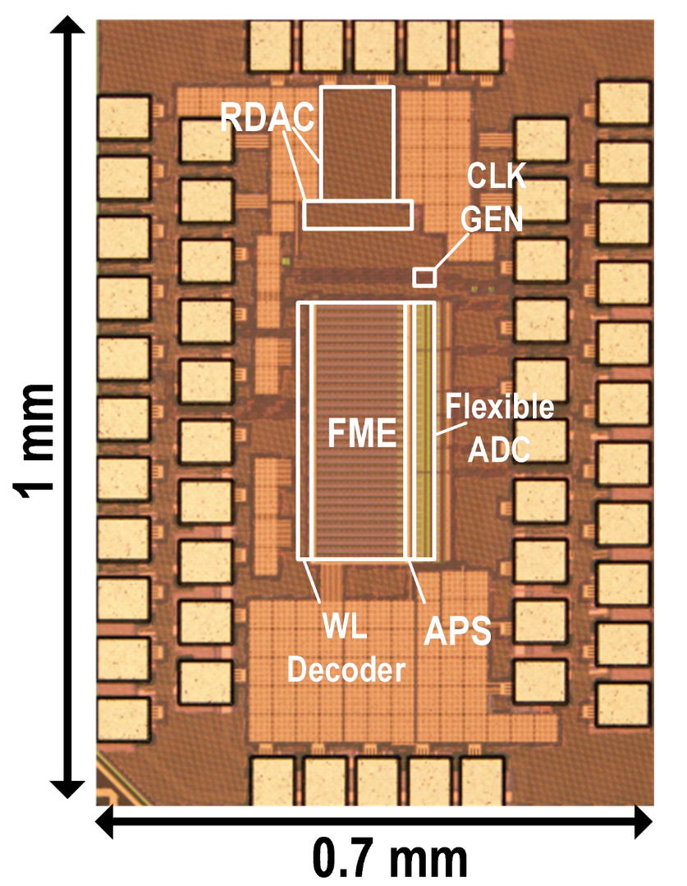

* **49 JSSC Papers (20 are Invited Papers)**

* **39 ISSCC Papers (10 are Highlight Papers, 5 Live Demos)**

* **4 SSCL Papers**

* **32 Papers in VLSI/A-SSCC/CICC/ESSCIRC/RFIC**

* **7 SSCS Predoctoral Achievement Awards**

* **4 ISSCC Awards (Top Paper Contributors, Silkroad, Student Research Preview, Student Design Contest)**

* **1 A-SSCC Distinguished Design Award**

* **1 RFIC Student Paper Award**

  
  

    
<strong>A 90.7-nW Vibration-Based Condition Monitoring Chip Featuring a Digital Compute-in-Memory-Based DNN Accelerator Using an Ultra-Low-Power 13T-SRAM Cell</strong>

    
Z. Zhang, W.-H. Yu, Z. Yang, K.-F. Un, J. Yin, R. P. Martins, P.-I. Mak

    <ul style="list-style-type: disc; margin: 0; padding-left: 20px;">
      <li>[JSSC'24]</li>
    </ul>
  

  
  

    
<strong>A 16-MHz Crystal Oscillator with 17.5-μs Startup Time under 10 4 -ppm-∆F Injection Using Automatic Phase-Error Correction</strong>

    
Z. Wang, X. Wang, K.-M. Lei, W. Zhang, Y. Yin, T. Xu, Z. Cai, Y. Guo, P.-I. Mak

    <ul style="list-style-type: disc; margin: 0; padding-left: 20px;">
      <li>[JSSC'24]</li>
    </ul>
  

  
  

    
<strong>A 28-nm 18.7 TOPS/mm 2 89.4-to-234.6 TOPS/W 8b Single-Finger eDRAM Compute-in-memory Macro with Bit-wise Sparsity Aware and Kernel-wise Weight Update/Refresh</strong>

    
Y. Zhan, W.-H. Yu, K.-F. Un, R. Martins, P.-I. Mak

    <ul style="list-style-type: disc; margin: 0; padding-left: 20px;">
      <li>[JSSC'24]</li>
    </ul>
  

  
  

    
<strong>A 24 V-Input 1-to-3.5 V-Output Interleaved-Inductor Multiple Step-Down Hybrid DC-DC Converter with Enhanced Power Density </strong>

    
X. Zhang, A. Zhao, Q. Ma, Y. Jiang, M.-K. Law, R. Martins, P.-I. Mak

    <ul style="list-style-type: disc; margin: 0; padding-left: 20px;">
      <li>[JSSC'24]</li>
    </ul>
  

  
  

    
<strong>FLEX-CIM: A Flexible Kernel Size 1-GHz 181.6-TOPS/W 25.6-TOPS/mm2 Analog Compute-in-Memory Macro</strong>

    
Y. Fu, W.-H. Yu, K.-F. Un, C.-H. Chan, Y. Zhu, M. Zhang, R. P. Martins and P.-I. Mak

    <ul style="list-style-type: disc; margin: 0; padding-left: 20px;">
      <li>[JSSC'24]</li>
    </ul>
  

  
  

    
<strong>A Cross-Coupled Hybrid Switched-Capacitor Buck Converter with Extended Conversion Range and Enhanced DCR Loss Reduction</strong>

    
Q. Ma, H. Li, X. Zhang, Y. Jiang, R. Martins, P.-I. Mak

    <ul style="list-style-type: disc; margin: 0; padding-left: 20px;">
      <li>[A-SSCC'23] [Invited JSSC'24]</li>
    </ul>
  

  
  

    
<strong>A BW-Extended 4th-Order Gain-Boosted N-Path Filter Employing a Switched gm-C Network</strong>

    
G. Qi, H. Guo, Y. Li, P.-I. Mak

    <ul style="list-style-type: disc; margin: 0; padding-left: 20px;">
      <li>[A-SSCC'23] [Invited JSSC'24]</li>
    </ul>
  

  
  

    
<strong>A 167μW 71.7dB-SFDR 2.4GHz BLE Receiver Using a Passive Quadrature-Front-End, a Double-Sided Double-Balanced Cascaded Mixer and a Dual-Transformer-Coupled Class-D VCO</strong>

    
H. Shao, R. P. Martins, P.-I. Mak

    <ul style="list-style-type: disc; margin: 0; padding-left: 20px;">
      <li>[ISSCC'24] [Invited JSSC'24]</li>
      <li>ISSCC Highlight Paper</li>
    </ul>
  

  
  

    
<strong>A 1.8% FAR, 2ms Decision Latency, 1.73nJ/Decision Keywords Spotting (KWS) Chip Incorporating Transfer-Computing Speaker Verification, Hybrid-Domain Computing and Scalable 5T-SRAM</strong>

    
F. Tan, W.-H. Yu, J. Lin, K.-F. Un, R. P. Martins, P.-I. Mak

    <ul style="list-style-type: disc; margin: 0; padding-left: 20px;">
      <li>[ISSCC'24]</li>
    </ul>
  

  
  

    
<strong>A Miniature Multi-Nuclei NMR/MRI Platform with a High-Voltage SOI ASIC Achieving a 134.4dB Image SNR with a 173×250×103µm3 Resolution</strong>

    
S. Fan, Q. Zhou, K.-M. Lei, R. P. Martins, P.-I. Mak

    <ul style="list-style-type: disc; margin: 0; padding-left: 20px;">
      <li>[ISSCC'24]</li>
    </ul>
  

  
  

    
<strong>A 0.5V 6.14μW Trimming-Free Single-XO Dual-Output Frequency Reference with [5.1nJ, 120μs] XO Startup and [8.1nJ, 200μs] Successive-Approximation-Based RTC Calibration</strong>

    
R. Luo, K.-M. Lei, R. P. Martins, P.-I. Mak

    <ul style="list-style-type: disc; margin: 0; padding-left: 20px;">
      <li>[ISSCC'24]</li>
      <li>ISSCC Live Demo</li>
    </ul>
  

  
  

    
<strong>A 12-28V to 0.6-1.8V Ratio-Regulatable Dickson SC Converter with Dual-Mode Phase Misalignment Operations Achieving 93.1% Efficiency and 6A Output</strong>

    
Q. Ma, Y. Jiang, H. Li, X. Zhang, M.-K. Law, R. P. Martins, P.-I. Mak

    <ul style="list-style-type: disc; margin: 0; padding-left: 20px;">
      <li>[ISSCC'24]</li>
    </ul>
  

  
  

    
<strong>A 23.2-to-26GHz Subsampling PLL Achieving 48.3fsrms Jitter, -253.5dB FoMJ, and 0.55μs-Locking-Time Based on Function-Reused VCO-Buffer and Type-I FLL with Rapid Phase Alignment</strong>

    
H. Li, T. Xu, X. Meng, J. Yin, R. P. Martins, P. I. Mak

    <ul style="list-style-type: disc; margin: 0; padding-left: 20px;">
      <li>[ISSCC'24]</li>
      <li>[Invited JSSC'24]</li>
    </ul>
  

  
  

    
<strong>A 0.027mm2 5.6-7.8GHz Ring-Oscillator-Based Ping-Pong Sampling PLL Scoring 220.3fsrms Jitter and −74.2dBc Reference Spur</strong>

    
Y. Huang, Y. Chen, Z. Yang, R. P. Martins, and P-I. Mak

    <ul style="list-style-type: disc; margin: 0; padding-left: 20px;">
      <li>[ISSCC'24]</li>
    </ul>
  

  
  

    
<strong>A 28nm 72.12-TFLOPS/W Hybrid-Domain Outer-Product Based Floating-Point SRAM Computing-in-Memory Macro with Logarithm Bit-Width Folding ADC</strong>

    
Y. Yuan, Y. Yang, X. Wang, X. Li, C. Ma, Q. Chen, M. Tang, X. Wei, Z. Hou, J. Zhu, H. Wu, Q. Ren, G. Xing, P-I. Mak, F. Zhang

    <ul style="list-style-type: disc; margin: 0; padding-left: 20px;">
      <li>[ISSCC'24]</li>
      <li>ISSCC Live Demo</li>
    </ul>
  

  
  

    
<strong>A 0.07mm2 20-to-23.8GHz 8-phase Oscillator Incorporating Magnetic + Dual-Injection Coupling Achieving 189.2dBc/Hz FoM@10MHz and 200.7dBc/Hz FoMA in 65nm CMOS</strong>

    
Y. Zhao, C. Fan, Q. Fang, G. Zhang, J. Yin, P-I. Mak, L. Geng

    <ul style="list-style-type: disc; margin: 0; padding-left: 20px;">
      <li>[ISSCC'24]</li>
    </ul>
  

  
  

    
<strong>An Outphase-Interleaved Switched-Capacitor Hybrid Buck Converter with Relieved Capacitor Inrush Current and COUT-Free Operations</strong>

    
X. Zhang, Q. Ma, A. Zhao, Y. Jiang, M.-K. Law, R. P. Martins, P.-I. Mak

    <ul style="list-style-type: disc; margin: 0; padding-left: 20px;">
      <li>[VLSI'23]</li>
      <li>[Invited JSSC'24]</li>
    </ul>
  

  
  

    
<strong>A 1024-Channel 268 nW/pixel 36×36 µm2/channel Data-Compressive Neural Recording IC for High-Bandwidth Brain-Computer Interfaces</strong>

    
M. Jang, M. Hays, W.-H. Yu, C. Lee, P. Caragiulo, A. Ramkaj, P. Wang, N. Vitale, P. Tandon, P. Yan, P.-I. Mak, Y. Chae, E.J. Chichilnisky, B. Murmann, and D. G. Muratore

    <ul style="list-style-type: disc; margin: 0; padding-left: 20px;">
      <li>[VLSI'23]</li>
      <li>[Invited JSSC'24]</li>
    </ul>
  

  
  

    
<strong>A 93.4% Peak Efficiency CLOAD-free Multi-Phase Switched-Capacitor DC-DC Converter Achieving a Fast DVS up to 222.5mV/ns</strong>

    
F. Li, Q. Fang, J. Wu, Y. Jiang, P.-I. Mak, R. P. Martins, M.-K. Law

    <ul style="list-style-type: disc; margin: 0; padding-left: 20px;">
      <li>[JSSC'24]</li>
    </ul>
  

  
  

    
<strong>A 0.05-mm2 2.91-nJ/Decision Keyword-Spotting (KWS) Chip Featuring an Always-Retention 5T-SRAM in 28-nm CMOS</strong>

    
F. Tan, W.-H. Yu, K.-F. Un, R.P. Martins, P.-I. Mak

    <ul style="list-style-type: disc; margin: 0; padding-left: 20px;">
      <li>[JSSC'24]</li>
    </ul>
  

